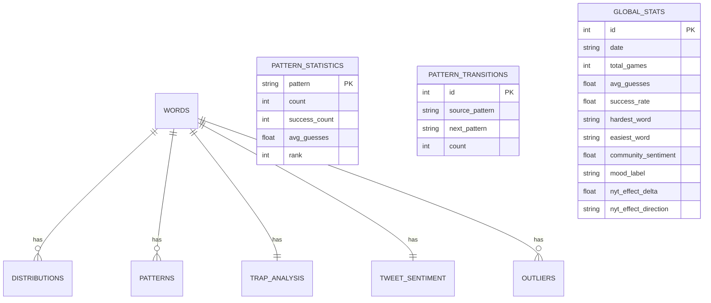

# Database Schema Documentation

## Overview
This document provides a comprehensive description of the database schema used by the Wordle analytics platform. The schema is defined in `backend/db/schema.py` using SQLAlchemy ORM models. It includes tables for words, distributions, sentiment analysis, pattern statistics, trap analysis, outliers, and aggregated global statistics.

---

## Tables

### `words`
| Column | Type | Description | Source / Definition |
|--------|------|-------------|--------------------|
| `id` | Integer (PK) | Wordle game ID / unique identifier | Raw Data (Kaggle/Official) |
| `word` | String | The target word for the game | Solutions Map / Game Data |
| `date` | String (unique) | Date of the game (YYYY‑MM‑DD) | Derived from Game ID or Solutions Map |
| `frequency_score` | Float | Letter frequency score based on English corpus | **Derived**: Weighted sum of letter frequencies normalized by word length. Uses letter weights (e='1.00', a='0.85', ..., q='0.01') |
| `difficulty_rating` | Integer | Computed difficulty (1‑10) | **Derived**: Multi-component formula: • Performance (60%): `(avg_guesses - 3.5) × 4` • Letter frequency (20%): `(1.0 - freq_score) × 2` • Word rarity (20%): `word_rarity_score × 2` • Base offset: `+3`, clamped to [1, 10] |
| `avg_guess_count` | Float | Average number of guesses taken | **Derived**: Weighted average from distribution data |
| `success_rate` | Float | Proportion of games solved | **Derived**: `Successful Games / Total Trials` |
| `created_at` | DateTime | Record creation timestamp | Database Default (`now`) |

**Difficulty Rating Labels:**
- **Easy** (1.0 - 4.0): Common words with straightforward letter patterns (~33% of words)
- **Medium** (4.1 - 6.0): Moderate difficulty, standard vocabulary (~33% of words)
- **Hard** (6.1 - 8.0): Challenging words with less common patterns (~25% of words)
- **Expert** (8.1 - 10.0): Rare words with unusual letter combinations (~9% of words)

### `distributions`
| Column | Type | Description | Source / Definition |
|--------|------|-------------|--------------------|
| `id` | Integer (PK) | | Internal ID |
| `word_id` | Integer (FK → `words.id`) | One‑to‑one relationship | Linked Word record |
| `date` | String | | Linked Date |
| `guess_1` … `guess_6` | Integer | Count of games solved in 1‑6 guesses | **Derived**: Aggregated from raw tweet scores |
| `failed` | Integer | Count of games that failed | **Derived**: Count of 'X/6' results in tweets |
| `total_tweets` | Integer | Number of tweets mentioning the word | **Derived**: Total valid Wordle tweets for the day |
| `avg_guesses` | Float | Average guesses for the day | **Derived**: Weighted mean of successful guesses |

### `tweet_sentiment`
| Column | Type | Description | Source / Definition |
|--------|------|-------------|--------------------|
| `id` | Integer (PK) | | Internal ID |
| `word_id` | Integer (FK → `words.id`, nullable) | | Optional linkage to Word |
| `date` | String (unique) | | Linked Date |
| `avg_sentiment` | Float | Mean compound sentiment | **Derived**: NLTK VADER compound score (-1 to 1) |
| `frustration_index` | Float | Proportion of frustrated users | **Derived**: `% of tweets with sentiment < -0.1` |
| `sample_size` | Integer | Total expressive tweets | Count of expressive (non‑grid) tweets |
| `very_pos_count` … `very_neg_count` | Integer | Sentiment bucket counts | **Derived**: Tallied from individual tweet sentiment |
| `top_words` | Text (JSON) | Top words in tweets | **Derived**: Most frequent terms (post‑stopword removal) |

### `pattern_statistics`
| Column | Type | Description | Source / Definition |
|--------|------|-------------|--------------------|
| `pattern` | String (PK) | Unique grid pattern | e.g. `🟩⬜⬜🟨⬜` |
| `count` | Integer | Total occurrences | Count across all games |
| `success_count` | Integer | Successful game inclusion | Count of times this led to a win |
| `avg_guesses` | Float | Performance metric | Average final guesses for games with this pattern |
| `rank` | Integer | Frequency rank | **Derived**: Rank by `count` (descending) |

### `pattern_transitions`
| Column | Type | Description | Source / Definition |
|--------|------|-------------|--------------------|
| `id` | Integer (PK) | | Internal ID |
| `source_pattern` | String | Previous state | e.g. Guess 2 pattern |
| `next_pattern` | String | Subsequent state | e.g. Guess 3 pattern |
| `count` | Integer | Transition frequency | Number of times Source followed by Next |

### `trap_analysis`
| Column | Type | Description | Source / Definition |
|--------|------|-------------|--------------------|
| `id` | Integer (PK) | | Internal ID |
| `word_id` | Integer (FK → `words.id`, unique) | | Linked Word |
| `trap_score` | Float | Sum of neighbor frequencies | **Derived**: Aggregated frequency of deadly neighbors |
| `neighbor_count` | Integer | Count of similar words | **Derived**: # of words with Hamming distance 1 |
| `deadly_neighbors` | Text (JSON) | List of similar words | **Derived**: JSON list identifying specific traps |

### `outliers`
| Column | Type | Description | Source / Definition |
|--------|------|-------------|--------------------|
| `id` | Integer (PK) | | Internal ID |
| `word_id` | Integer (FK → `words.id`) | | Linked Word |
| `date` | String | | Linked Date |
| `outlier_type` | String | Category of anomaly | e.g. `viral_frustration`, `quiet_day` |
| `metric` | String | Dimension of anomaly | `volume` or `sentiment` |
| `actual_value` | Float | Observed value | Observed metric value |
| `expected_value` | Float | Metric baseline | **Derived**: Dataset mean for metric |
| `z_score` | Float | Statistical deviation | **Derived**: Standard deviations from mean |
| `context` | Text | Description of outlier | Generated textual context |
| Index `ix_outlier_type_zscore` on (`outlier_type`, `z_score`) |

### `global_stats`
| Column | Type | Description | Source / Definition |
|--------|------|-------------|--------------------|
| `id` | Integer (PK) | | Internal ID |
| `date` | String (index) | | Linked Date |
| **Overview Metrics** | | | |
| `total_games` | Integer | Global daily total | Sum of games across dates |
| `avg_guesses` | Float | Global daily mean | Weighted mean of guesses |
| `success_rate` | Float | Global solve rate | Aggregated win percentage |
| **Key Highlights** | | | |
| `hardest_word` … | (Multiple) | Highlight metrics | Selected extremes (min/max) for the day |
| **Community & Trends** | | | |
| `community_sentiment` | Float | Global mood | **Derived**: Mean sentiment for the day |
| `mood_label` | String | Textual mood tag | **Derived**: Label from `positive_pct` |
| `positive_pct` | Float | Proportion of positive days | **Derived**: `% of days with sentiment > 0` |
| `nyt_effect_delta` | Float | Acquisition impact | **Derived**: `Avg Post-NYT - Avg Pre-NYT` |
| `nyt_effect_direction` | String | Impact direction | `Increase` or `Decrease` |
| `created_at` | DateTime | | Database Default |

---

## Relationships
- `Word` ↔ `Distribution` (one‑to‑one, `word_id`)
- `Word` ↔ `Pattern` (one‑to‑many)
- `Word` ↔ `TrapAnalysis` (one‑to‑one)
- `Word` ↔ `TweetSentiment` (one‑to‑one, optional)
- `Word` ↔ `Outlier` (one‑to‑many)
- `PatternStatistic` and `PatternTransition` are independent tables used for pattern analytics.

---

## ER Diagram (Mermaid)

---

## ETL Module References
- **`backend/etl/extract.py`** – Loads raw CSV data for games and tweets, validates schemas, and provides helper functions `load_kaggle_games_raw`, `load_kaggle_tweets_raw`, and `load_wordle_guesses`.
- **`backend/etl/transform.py`** – (Not shown here) transforms raw data into the shape required by the loading functions, e.g., calculating `frequency_score`, `difficulty_rating`, and aggregating tweet sentiment.
- **`backend/etl/load.py`** – Contains bulk upsert functions:
  - `load_games_data` → populates `words` and `distributions` tables.
  - `load_tweets_data` → populates `tweet_sentiment`.
  - `load_patterns_data` → populates `pattern_statistics` and `pattern_transitions`.
  - `load_outliers_data` → populates `outliers`.
  - `load_trap_data` → populates `trap_analysis`.
  - `load_global_stats` → populates `global_stats`.

These functions ensure data integrity by deleting existing rows for the same identifiers before bulk inserting, making the ETL process idempotent.

---

*Generated on 2026‑01‑01.*
